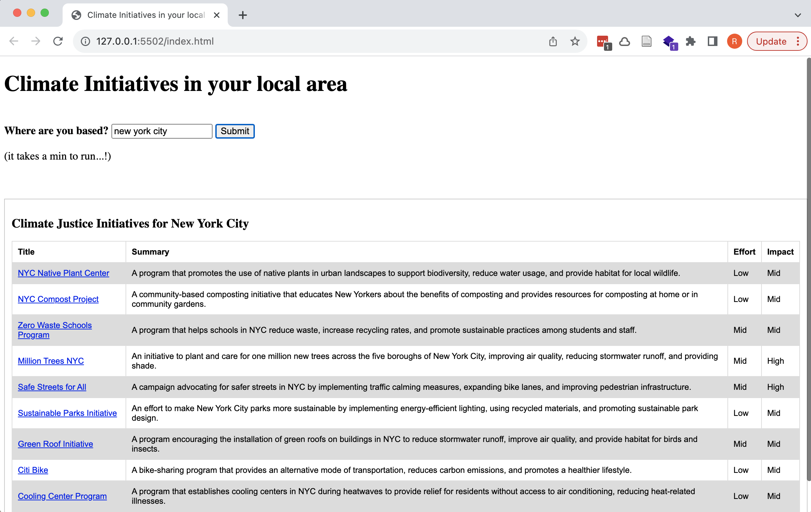
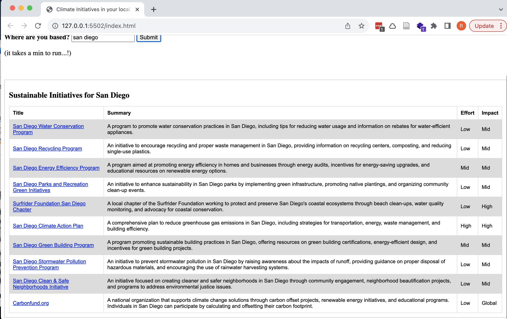

# Sustainable Initiatives LLM Generator

This tool, powered by OpenAI's language model (LLM), aims to provide personalized suggestions for sustainable initiatives based on user inputs. The user provides their location (in any format such as zip code, city name, neighborhood, country, etc.), and the tool generates a prompt suggesting actionable sustainable initiatives.

## Usage

### Web Interface (Local)
1. Clone this repository to your local machine.
2. Open the script.js file and insert your ChatGPT API key.
3. Open the index.html file in a web browser.
4. Enter the user's location in the provided input field and submit.

Note: This web interface currently runs locally, and you need to provide your own ChatGPT API key.

### Example Screenshots 

New York City (NYC)

San Diego:

### Notebook Example
Check out the notebook example to interact with the ChatGPT API. Note that the output in the notebook might not be as legible due to formatting.